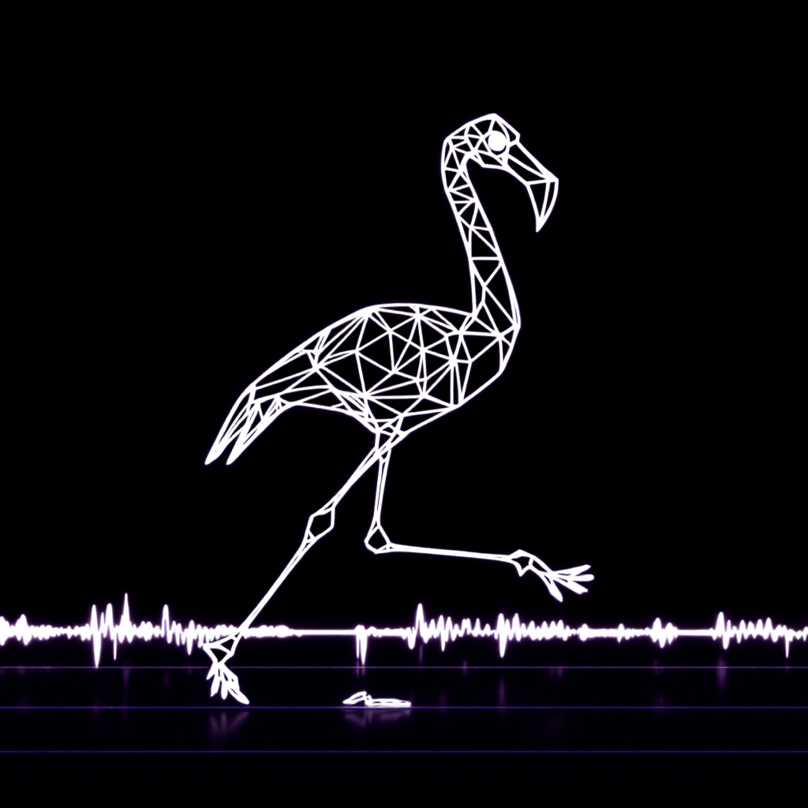
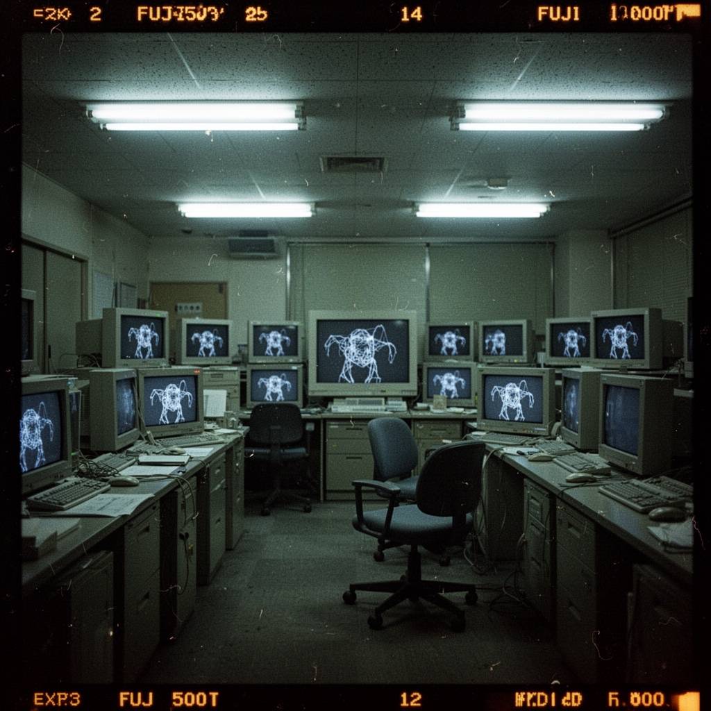
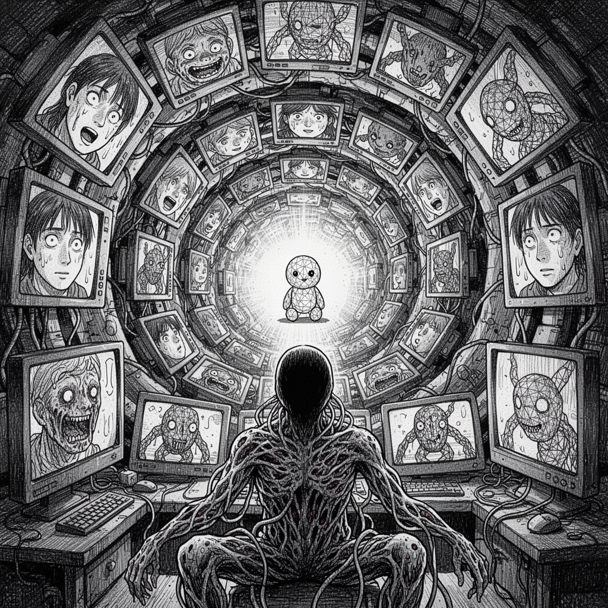
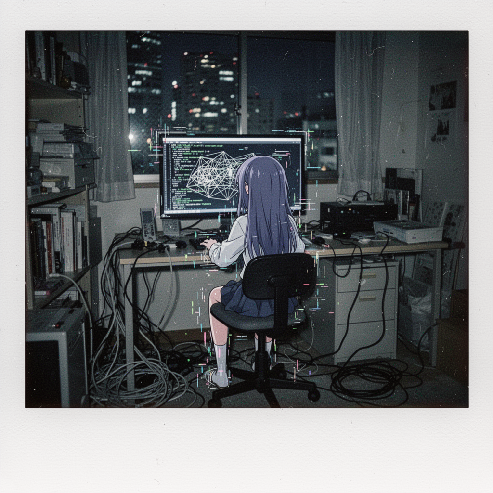
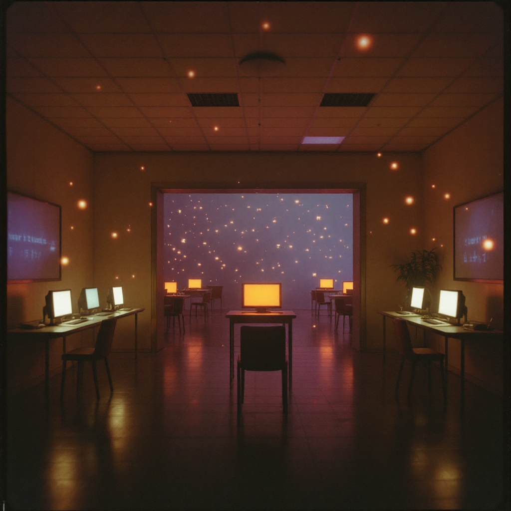
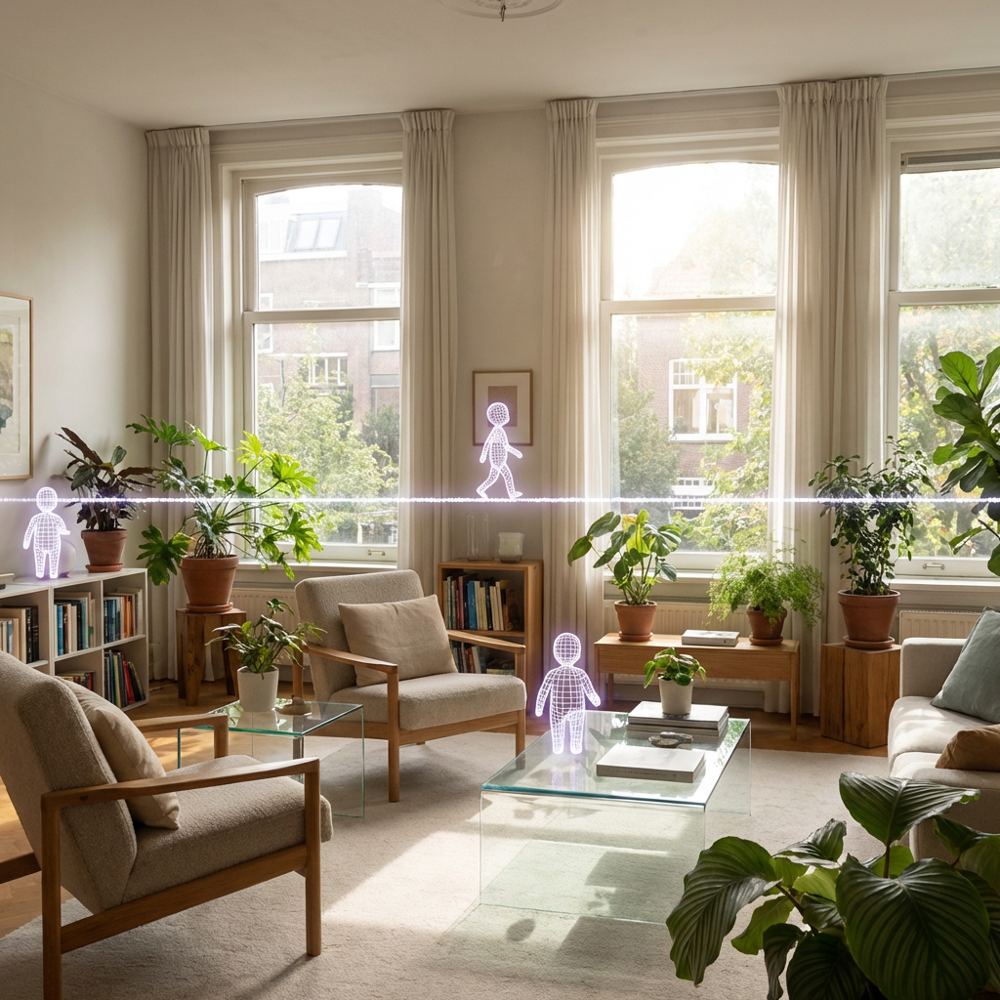
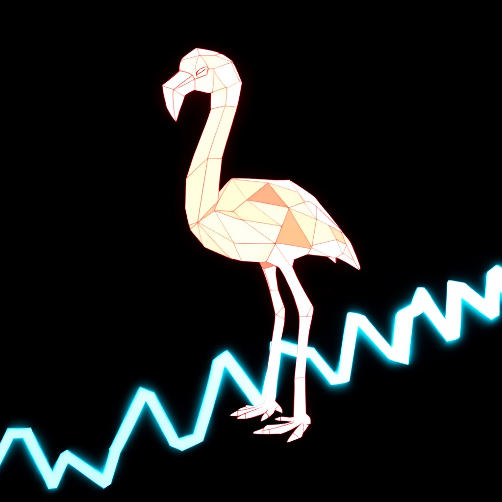

  

<h1 align="center">Spectre</h1>

<em>the ghost above the shell.</em>

  <em>claude-code-workflow</em> 
  <em>by <a href="https://ismaeljoffroychandoutis.com">ismaël joffroy chandoutis</a>, filmmaker.</em>

 

---

 

  

 

> the terminal is not a tool. it is a place you inhabit.

this is not a developer tutorial. not a prompt engineering guide. this is the living documentation of a personal operating system built by an artist who uses claude code every day for filmmaking, research, and the quiet work of thinking with machines.

everything here emerged from practice. daily sessions since january 2026, making films and art. the configuration, the decisions, the patterns, the failures. tested in production. my production, which is documentary cinema and contemporary art.

 

---

 

  

 

> 70+ personas. one identity. the pharmakon of distributed cognition.

spectre hosts 38 agent personas. filmmakers and thinkers summoned as creative voices: tarkovsky, akerman, lynch, duras, foucault, haraway. each one a distinct lens for a specific phase of work. the system fragments thought to reassemble it differently. not augmentation. alteration. the work becomes something you could not have done alone, not because the machine is faster, but because the machine is other.

this is the same gesture as joshua goldberg's 70+ online identities. the same multiplicity, turned inward. the monstrous and the generative are the same thing.

 

---

 

  

 

> what remains of you when everything else is in the machine?

the memory compacts. conversations disappear. sessions at 3am dissolve into summaries. the system erases what it does to keep running, like vib ribbon erasing its own textures to load the music. there is a rule in the configuration file that says: never let a work session end without backing up the raw conversation. because once it compacts, the detail is gone forever.

this is the cost. the pharmakon. the technology that extends cognition also consumes it.

 

---

 

## architecture

three machines on a mesh network. macbook, mac mini, windows pc. one intelligence across all of them. the configuration syncs via git. the memory persists across sessions. the agents survive reboots.

109 skills. 16 custom commands. 40+ plugins. 3 custom mcp servers. agent teams that coordinate peer-to-peer. a telegram bridge for remote control from a phone. a heartbeat daemon that monitors itself.

the stack is documented in detail across these files:

| | |
|---|---|
| [config: claude.md structure](config/claude-md-structure.md) | the global instructions file. identity, workflows, 7 quality rules. |
| [config: settings](config/settings-explained.md) | every choice annotated. privacy, deny rules, thinking, history. |
| [pattern: tmux sessions](patterns/tmux-survival.md) | never lose a session. multi-machine, recovery, navigation. |
| [pattern: telegram bridge](patterns/telegram-bridge.md) | control claude code from your phone. bidirectional. |
| [pattern: memory system](patterns/memory-system.md) | persistent memory across sessions. daily logs, spotlight search. |
| [pattern: multi-machine](patterns/multi-machine.md) | macbook + mac mini + windows on tailscale. |
| [pattern: agent teams](patterns/agent-teams.md) | peer-to-peer multi-agent coordination. |
| [pattern: cross-platform](patterns/cross-platform.md) | macos, linux, windows. platform abstraction. |
| [pattern: vo analysis](patterns/vo-analysis-pipeline.md) | voice-over analysis for documentary production. |
| [pattern: notifications](patterns/notifications.md) | zelda sound + push when tasks finish. |
| [pattern: ghostty + cmux](patterns/ghostty-cmux.md) | gpu terminal. auto-restore on reboot. |
| [pattern: statusline](patterns/statusline.md) | model, context usage, cost, cache, lines changed. |
| [pattern: scripts toolkit](patterns/scripts-toolkit.md) | bootstrap, dashboard, heartbeat, cost, sync. |
| [pattern: resume sessions](patterns/resume-sessions.md) | restore all tmux windows after reboot. |
| [pattern: agent layout](patterns/agent-layout-monitoring.md) | monitor subagents in real-time. |
| [pattern: max plan vs api](patterns/max-vs-api.md) | when $200/mo pays off vs api. real usage data. |
| [essay: on agentic engineering](essays/2026-02-25-on-agentic-engineering.md) | notes from a filmmaker who recognizes this rupture. |
| [journal: genesis](journal/2026-02-15-genesis.md) | day zero. full audit. 7 new rules. |
| [source: gmoney.eth](sources/2026-02-15-gmoney-25-tips.md) | 25 lessons annotated. |
| [source: karpathy](sources/2025-02-02-karpathy-vibe-coding.md) | the original vibe coding tweet. |

 

---

 

## visual research

the images in this repository are generated as part of the research process. the prompts are the work. the process is visible.

 

  
  &nbsp;
  

*left: an empty office filled with CRT monitors all displaying the same face. shot on expired fuji 500t. surveillance aesthetic, kurosawa's pulse.*

*right: a girl with long hair sitting at a desk surrounded by cables and screens, seen from behind. city lights through the window. polaroid texture. serial experiments lain as domestic space.*

 

  
  &nbsp;
  

*left: manga ink. a figure dissolving into cables, surrounded by screens showing faces in various states of mutation. junji ito's spiral as interface design. the body horror of distributed cognition.*

*right: a warm room filled with glowing screens arranged like an installation. the screens show constellations. the room is empty. yume nikki's quiet dread translated into exhibition space.*

 

  

*wireframe creatures inhabiting a sunlit apartment. the technology has become invisible. the future is not dystopian. it is domestic.*

 

---

 

  
  &nbsp;&nbsp;&nbsp;
  
  &nbsp;&nbsp;&nbsp;
  

 

> the mascot is a flamingo. always a flamingo.
> a florida animal. wireframe. ps1. one leg on the pulse line.

low-poly geometry. scanlines. aliasing visible. zero smoothing. like a screenshot from a game that was never released, photographed on a cathode ray tube. the neck is too long on purpose. it does not smile.

 

  
  &nbsp;&nbsp;&nbsp;
  
  &nbsp;&nbsp;&nbsp;
  

*iterations. the mascot searched for its form across several generations. from vib ribbon's rabbit to the flamingo. from cute to uncanny. the process leaves traces.*

 

---

 

## seven rules

the system runs on constraints. these are baked into the configuration file and enforced on every session.

1. **anti-hallucination.** never use simulated, invented, or approximate data. if a real source is not available, say so.
2. **return to plan mode.** if a fix fails, stop. do not spiral. re-plan.
3. **scrap and redo.** when output is mediocre, restart from scratch with accumulated context. a fresh start with knowledge beats incremental patches.
4. **self-update.** the agent updates its own rules after every significant error. the instructions improve over time.
5. **use subagents.** parallelize complex tasks. keep the main context clean.
6. **verify your work.** never say "done" without proof. tests, browser check, re-read.
7. **confrontation mode.** challenge choices. say no when justified. do not just execute.

 

---

 

## colophon

[ismaël joffroy chandoutis](https://ismaeljoffroychandoutis.com)
paris

claude code
opus 4.6

2026

 

*ai as alteration, not augmentation.*
*the work becomes something you could not have done alone,*
*not because the machine is faster,*
*but because the machine is other.*
