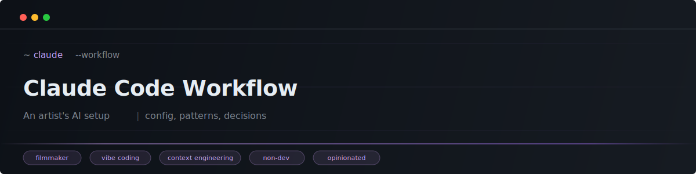

  

Not a developer tutorial. Not a prompt engineering guide. This is a real, opinionated setup built by an artist who uses Claude Code every day for filmmaking, creative tools, and vibe coding.

---

## Context

I'm [Ismaël Joffroy Chandoutis](https://ismaeljoffroychandoutis.com), a filmmaker and artist based in Paris. I work across cinema, contemporary art, and new media. I'm not a developer. I use Claude Code as a creative and technical partner to build tools, automate workflows, and explore AI as an artistic method.

This repo documents the actual configuration, decisions, and patterns that emerged from daily usage since January 2026. Everything here is tested in production (my production, which is making films and art).

## What's inside

### Config

How the agent is configured, and why.

| File | What it covers |
|------|---------------|
| [CLAUDE.md structure](config/claude-md-structure.md) | The global instructions file: identity, workflows, 7 quality rules (anti-hallucination, scrap-and-redo, self-updating rules, confrontation mode...) |
| [Settings explained](config/settings-explained.md) | Every `settings.json` choice annotated: privacy (telemetry off), deny rules (minimal: only block the irreversible), statusline, agent teams, extended thinking |

**Key decisions:**
- Deny rules are minimal by design: only block irreversible commands. The `claude` (interactive permissions) vs `clauded` (bypass) separation handles daily control.
- Telemetry fully disabled (Trail of Bits approach).
- Extended thinking always on.
- Conversation history kept 365 days instead of 30.

### Patterns

Reusable analysis, decision frameworks, and automation scripts.

| File | What it covers |
|------|---------------|
| [Max Plan vs API](patterns/max-vs-api.md) | When Claude Code Max ($100/mo) becomes cheaper than API pay-per-use. Breakpoint analysis with real numbers. |
| [tmux Survival Guide](patterns/tmux-survival.md) | Never lose a session. Multi-machine setup, remote access, recovery after reboot, navigation cheatsheet. |
| [Telegram Bridge](patterns/telegram-bridge.md) | Control Claude Code from your phone via Telegram. Bidirectional: text, voice, images, files. Multi-window support. |
| [Notifications](patterns/notifications.md) | Get notified when tasks finish. Sound (Zelda!) + push notifications (Pushover/Telegram/native macOS). |
| [Statusline](patterns/statusline.md) | Two-line status bar: model, project, context usage progress bar (color-coded), cost, duration, cache %, lines changed. |
| [Scripts Toolkit](patterns/scripts-toolkit.md) | All automation scripts: bootstrap, dashboard, heartbeat, cost calculator, memory search, sync, nosleep, resume sessions. |
| [Memory System](patterns/memory-system.md) | Persistent memory across sessions. Daily logs, backlog tracking, Spotlight search. Claude Code remembers what you did yesterday. |
| [Resume Sessions](patterns/resume-sessions.md) | Restore all tmux windows after a reboot with `claude --resume`. One script, priority-ordered, named windows. |

### Journal

Decisions log. What we tried, what worked, what we dropped.

| File | What it covers |
|------|---------------|
| [Genesis](journal/2026-02-15-genesis.md) | Day zero of systematic documentation. Full audit of our setup against gmoney.eth's 25 tips. Resulted in 7 new CLAUDE.md rules, statusline, deny rules, tmux aliases, daily memory logs. |

### Sources

Articles and threads that shaped the setup.

| File | What it covers |
|------|---------------|
| [gmoney.eth - 25 lessons](sources/2026-02-15-gmoney-25-tips.md) | Annotated breakdown of @gmoneyNFT's thread (Feb 2026). Each tip scored: already implemented, implemented after reading, to explore later, decided against. |

## Core principles

**AI as alteration, not augmentation.** The agent isn't here to make me faster. It's here to make the work different from what I would have done alone.

**Specs before code.** Every project starts with an interview phase (20-30 questions for dev, 15-25 for creative). No implementation without specs. Two custom skills enforce this: `/interview` and `/pitch`.

**7 quality rules** baked into CLAUDE.md:

1. **Anti-hallucination** -- never use simulated, invented, or approximate data
2. **Return to plan mode** -- if a fix fails, stop. Don't spiral. Re-plan.
3. **Scrap and redo** -- when output is mediocre, restart from scratch with accumulated context
4. **Self-update** -- the agent updates its own rules after every significant error
5. **Use subagents** -- parallelize complex tasks, keep main context clean
6. **Verify your work** -- never say "done" without proof (tests, browser check, re-read)
7. **Confrontation mode** -- challenge choices, say no when justified, don't just execute

## Stack

- **Claude Code** on Max plan (Opus + Sonnet + Haiku)
- **tmux** for parallel sessions (aliases `za`/`zb`/`zc`/`zd`)
- **10+ MCP servers** (TMDB, filesystem, browser devtools...)
- **18 custom skills** (interview, pitch, video processing, SEO, art generation...)
- **Hooks**: Zelda notification sound + Telegram push on task completion
- **VoiceInk** for voice dictation (offline, open source)
- **Memory system**: `MEMORY.md` + daily logs in `memory/YYYY-MM-DD.md`

## Influences

- [Trail of Bits](https://github.com/trailofbits/claude-code-config) -- opinionated security defaults
- [@bcherny](https://x.com/bcherny) (Claude Code creator) -- team tips
- [@gmoneyNFT](https://x.com/gmoneyNFT) -- 25 lessons from daily multi-agent usage
- [@__BOMO](https://x.com/__BOMO) -- context window statusline

## Status

Living document. Updated after every significant session or setup change.

---

*This is not a template to copy. It's a reference for people building their own relationship with an AI coding tool, especially non-developers using it for creative work.*
